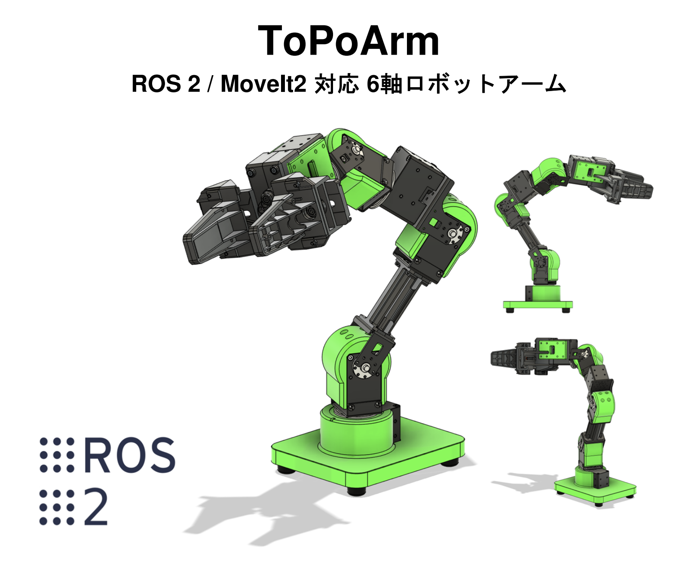
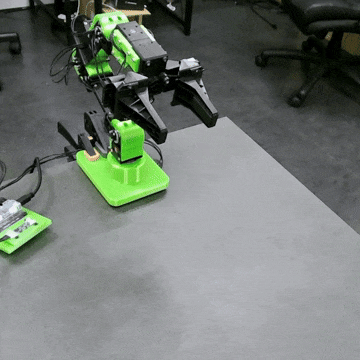
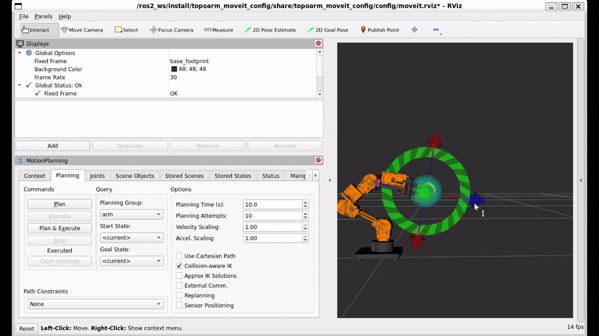
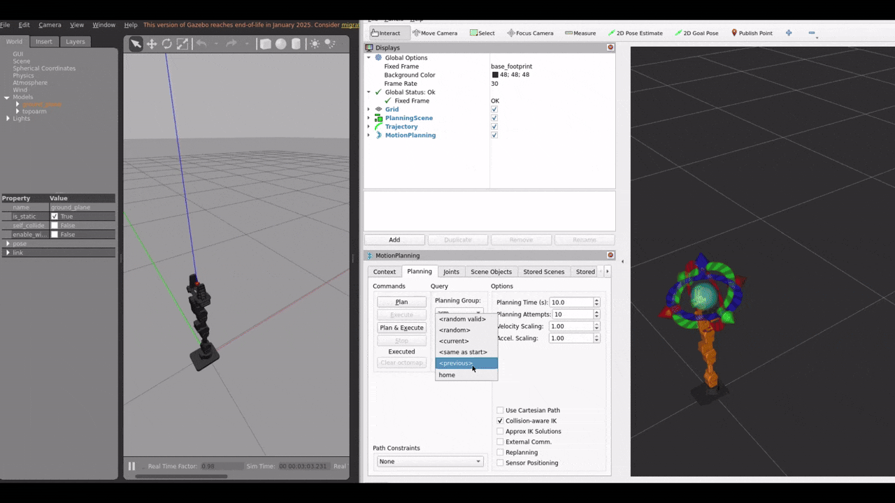

# ToPoArm



## 1. 環境構築

### 1.1. 前提条件

- Ubuntu 22.04
- ROS2 Humble

### 1.2. 必要なライブラリのインストール

```
sudo apt update && sudo apt install -y ros-humble-ros2-control ros-humble-ros2-controllers ros-humble-gripper-controllers ros-humble-moveit ros-humble-gazebo-* ros-humble-joint-state-publisher-gui
```

### 1.3. ビルド＆インストール
```
cd ~/ros2_ws/src/
git clone https://github.com/fuzzrobo/topoarm.git
cd ..
colcon build --symlink-install
```

### 1.4. udevルールの設定
```
cd ~/ros2/src/topoarm
sudo cp topoarm/99-robotis-u2d2.rules /etc/udev/rules.d/
sudo udevadm control --reload && sudo udevadm trigger
ls /dev/ttyDXL*
```
以下のように出力されれば、正常に認識されています。
```
/dev/ttyDXL_u2d2
```

## 2. 実機での実行方法

### 2.1. bringup の起動

```
ros2 launch topoarm_bringup hardware.launch.py
```

### 2.2. Moveit 2の起動

<table>
  <tr>
    <td style="padding: 5px;">
      
    </td>
    <td style="padding: 5px;">
      
    </td>
  </tr>
</table>

```
ros2 launch topoarm_moveit_config moveit_core.launch.py
```

## 3. Gazeboでの実行方法

### 3.1. bringup の起動

```
ros2 launch topoarm_bringup gazebo.launch.py
```

### 3.2. Moveit 2の起動



```
ros2 launch topoarm_moveit_config moveit_core.launch.py use_sim:=true
```